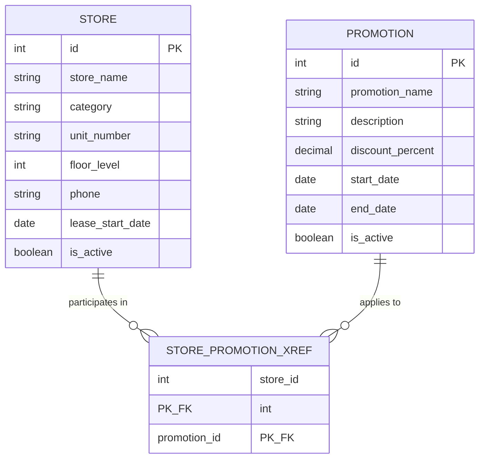

# Shopping Mall Stores and Promotions Database

IT 566: Computer Scripting Techniques — Summer 2026 Semester Project
Student: Patricia Nkrumah

This folder contains the data model and database scripts for the Shopping
Mall Stores and Promotions project, following the drop/recreate scripting
pattern from Chapters 23 and 24.

## Project description

Promotions apply to many stores. Stores participate in many promotions.
This is a many-to-many relationship, resolved with a cross-reference table.

- **Primary entities**: `store`, `promotion`
- **Cross-reference table**: `store_promotion_xref`

## Contents

| File | Purpose |
|---|---|
| `create_database.sql` | Drops `shopping_mall` if it exists and recreates it. |
| `create_tables.sql` | Drops and recreates `store`, `promotion`, and `store_promotion_xref`, including primary keys, auto-increment, and foreign key constraints. |
| `insert_test_data.sql` | Loads sample stores, promotions, and their many-to-many associations. |
| `README.md` | This file — ERD, data dictionary, and setup instructions. |

## How to run

Run the three scripts in order from the `database` directory:

```bash
mysql < create_database.sql
mysql < create_tables.sql
mysql < insert_test_data.sql
```

Each script is idempotent — `create_database.sql` and `create_tables.sql`
both drop-then-create, so the whole database can be rebuilt from nothing at
any time by re-running all three scripts in order, including live during a
demo.

To verify:

```sql
USE shopping_mall;
SHOW TABLES;
SELECT * FROM store;
SELECT * FROM promotion;
SELECT * FROM store_promotion_xref;
```

## Entity relationship diagram



## Data dictionary

### store
A physical retail unit leased within the mall.

| Column | Type | Constraints | Description |
|---|---|---|---|
| id | INT(11) | PK, AUTO_INCREMENT | Unique store identifier |
| store_name | VARCHAR(100) | NOT NULL | Name of the store |
| category | VARCHAR(50) | NOT NULL | Store category (e.g. Apparel, Electronics, Food & Beverage) |
| unit_number | VARCHAR(10) | NOT NULL | Mall unit/suite number |
| floor_level | INT(11) | NOT NULL | Floor the store is located on |
| phone | VARCHAR(20) | NOT NULL | Store contact phone number |
| lease_start_date | DATE | NOT NULL | Date the store's current lease began |
| is_active | TINYINT(1) | NOT NULL, DEFAULT 1 | Whether the store is currently operating |

### promotion
A discount or marketing event that one or more stores can participate in.

| Column | Type | Constraints | Description |
|---|---|---|---|
| id | INT(11) | PK, AUTO_INCREMENT | Unique promotion identifier |
| promotion_name | VARCHAR(100) | NOT NULL | Name of the promotion |
| description | VARCHAR(255) | NOT NULL | Description of the promotion |
| discount_percent | DECIMAL(5,2) | NOT NULL | Discount percentage offered |
| start_date | DATE | NOT NULL | Date the promotion begins |
| end_date | DATE | NOT NULL | Date the promotion ends |
| is_active | TINYINT(1) | NOT NULL, DEFAULT 1 | Whether the promotion is currently running |

### store_promotion_xref
Cross-reference table resolving the many-to-many relationship between
`store` and `promotion` — a promotion applies to many stores, and a store
participates in many promotions.

| Column | Type | Constraints | Description |
|---|---|---|---|
| store_id | INT(11) | PK (composite), FK → store.id | Participating store |
| promotion_id | INT(11) | PK (composite), FK → promotion.id | Promotion the store participates in |

The composite primary key (`store_id`, `promotion_id`) prevents the same
store from being linked to the same promotion more than once. Both foreign
keys cascade on delete/update, so removing a store or promotion
automatically cleans up its cross-reference rows.

## Design notes

- **Follows the Chapter 23/24 scripting pattern**: three separate scripts (database, tables, test data), backtick-quoted identifiers, `DROP ... IF EXISTS` / `CREATE ... IF NOT EXISTS`, and primary key / auto-increment added via `ALTER TABLE` after `CREATE TABLE`, matching the textbook's `employee_training` example.
- **Drop order matters**: `create_tables.sql` drops `store_promotion_xref` before `store` and `promotion`, since the cross-reference table holds foreign keys into both parent tables.
- **Composite primary key** on `store_promotion_xref` (rather than a separate surrogate `id`) enforces that a store/promotion pairing can only exist once, which is the natural constraint for a pure many-to-many linking table.
- **Idempotent and demo-safe**: running all three scripts in order always produces the same result, so the database can be dropped and rebuilt from scratch at any time, including live.
